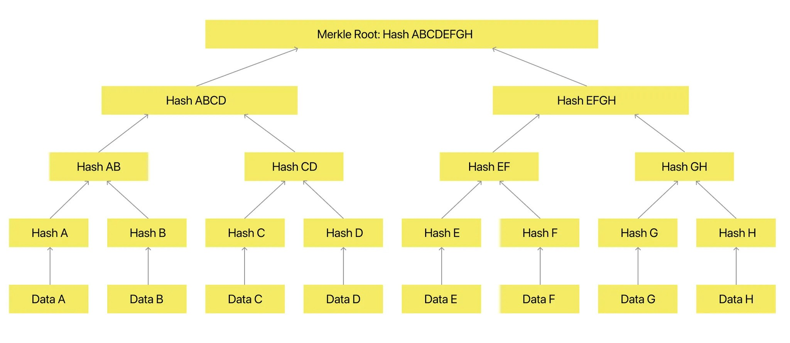

# Lab Name
OpenOrigins HOPrS v1.0

# Short Description
HOPrS (Human-Oriented Proof System) is a cryptographic framework that establishes trust in digital media through decentralized authentication and immutable provenance verification. HOPrS fingerprints digital content to detect manipulations and provide proof of authenticity. This solution addresses the challenges of misinformation, synthetic media, and copyright infringement, offering a scalable, open-source system.

# Scope of Lab
Trust in content authenticity and provenance is increasingly challenged by the rise of synthetically generated media, sophisticated editing tools, and unauthorized manipulations of broadcast content. HOPrS (Human-Oriented Proof System) is a solution in this rapidly evolving landscape of digital media. The project is a natural extension of OpenOrigins’ goal of developing technologies that create decentralized media trust and verification.

HOPrS introduces a method to cryptographically fingerprint media files, enabling detailed detection of alterations and tamper-proof verification of authenticity. This work complements ongoing efforts in the Linux Foundation’s Decentralized Trust ecosystem, specifically aligning with principles of verifiable data and decentralized identity management.

While existing technologies address aspects of decentralized trust, HOPrS focuses on the underrepresented area of establishing trust in visual and media assets in a decentralized manner. Its design bridges the gap between decentralized trust and the authentication needs of media-heavy industries, including journalism, digital marketing, and social platforms.

By leveraging cryptographic principles and blockchain infrastructure, HOPrS integrates into decentralized ecosystems. Additionally, the system’s modular design allows for future collaboration and integration with both incubated and graduated Linux Foundation projects, strengthening its utility and adoption within the broader open-source community.

# Solution
### **HOPrS: Human-Oriented Proof System**

HOPrS (Human-Oriented Proof System) is a cryptographic framework designed to provide tamper-proof authentication and verifiable provenance for digital media. It integrates perceptual hashing, quad-tree segmentation, and Merkle Tree cryptographic anchoring to ensure media authenticity while remaining resistant to minor modifications and adversarial manipulations.

Unlike traditional verification methods that rely on metadata tracking, watermarks, or centralized authorities, HOPrS anchors cryptographic fingerprints of media files to a blockchain, ensuring that authenticity can be independently verified while preserving privacy and efficiency.

### How HOPrS Works

1. **Perceptual Hashing – Feature Extraction**

Perceptual Hashing is a technique for producing a fingerprint (hash) of an image that represents the visual characteristics of that image. Visually similar images produce similar hashes, and the hamming distance (number of differing bits) between them can be used to determine how similar two images are. These are very different to cryptographic hashes whereby small changes should produce a very large difference (avalanche effect). A typical hash might be from 64-256 bits in length.

Perceptual hashing algorithms either compare characteristics of areas of images, such as the relative lightness compared to neighbours and the overall image coupled with the intensity of gradients in regions, or they decompose the image into sets of waves using Fourier related transformations and allow the hash to be calculated from parameters of those waves, or they use Convolutional Neural Networks to repeatedly merge neighbouring pixels.

- Extracts unique visual features from media to generate a perceptual hash.
- Resistant to minor modifications such as compression or noise but detects significant changes.
- Allows comparison between altered and original files.

2. **QuadTree Segmentation – Localizing Changes**

Quad trees are a technique for breaking a large image into a nested structure of smaller images. They are commonly used in video games, where there may be many objects on screen that need to be compared with each other. Using quad trees we can limit expensive operations like collision detection to pairs of objects that occupy the same small area of the screen, vastly reducing the total number of comparisons.

The image is divided into quarters, and each of those quarters is divided into quarters, and so on, down to some depth.

That depth may be uniform for the whole image, or some areas of the image may have more depth. For instance, a large area of the screen in a video game may have only a few objects, and therefore not be subdivided further.

In our case, the final depth is determined by the areas of the edited image that have differences from the the original. Areas without differences are shallow, areas with scattered differences descend to the boundary.

- Images are divided into a hierarchical quad-tree structure.
- Segmentation depth adapts based on the level of modification.
- Helps pinpoint specific areas of manipulation rather than treating an entire file as binary authentic/manipulated.

Figure 1: Test image - ’aeroplane’ Hawker Fury, Duxford 2023, taken by author on iPhone

Figure 2: Test image - ’aeroplane modified’ Yellow sun addition

Figure 3: Modifications - image is annotated with an overlay of the quadtrees

3. **Merkle Tree Cryptographic Anchoring – Immutable Proof of Authenticity**

A pointer is a reference to a position in a computer’s memory. A hash is a unique fingerprint of a chunk of data. Merkleization is replacing pointers with hashes.

We start by hashing the leaf objects, and then replace all the pointers to those leaf objects with hashes. We then find all the new leaf objects, which are objects that only had pointers to leaf objects in the original data structure and repeat with those. This terminates when no nodes with pointers remain, and the result is the Merkleized version of the original data structure.

Using a hash instead of a pointer means the object behind that hash can never change. It is permanent and immutable. Hashes are frequently used to reduce a large amount of data to a fixed amount – for instance, when a message is signed cryptographically it is actually the hash of the message that is signed, because that is generally much smaller than the message.

Merkleizing the MQP structure allows us to exclude branches while still matching the root hash that was signed. Without Merkleization we would need to provide the entire quadtree, which might be quite large, in order to match the signature. With Merkleization we can leave out most of the quadtree, yielding a significant space-saving optimization (more than 100x in most cases).

- Perceptual hashes from quad-tree segments are organized into a Merkle Tree.
- Each node stores a hashed representation of an image segment.
- The root hash is stored on the blockchain, allowing decentralized verification.

Figure 4: Merkle Tree creation

4. **Decentralized Traceability – Versioning and Provenance**
- Media versions are tracked over time.
- Each version maintains a cryptographic link to its previous iteration.
- Ensures integrity across multiple platforms and editing stages.

Figure 5: Provenance Tracking workflow chart

# Initial Committers
- [Mansoor Ahmed](https://github.com/humannyty), PhD - OpenOrigins (m@openorigins.com)
- [Henrik Cox](https://github.com/henrikcox) - OpenOrigins (henrik@openorigins.com)
- [Matt Brown](https://github.com/mattnbrown) - OpenOrigins (matt@openorigins.com)
- [Artem Kovtun](https://github.com/artem-openorigins) - OpenOrigins (artem@openorigins.com)
- [Alex Ross](https://github.com/Alex-OpenOrigins) - OpenOrigins (alex@openorigins.com)
- [Matthew Pendlebury](https://github.com/matthewpendlebury) - Independent (matti@pendlebury.org)

# Sponsor
No current sponsors
- https://github.com/<user_id> or Name (email@example.org) - Role (e.g., "Chair of the XXX workgroup")

# Pre-existing repository
_If you currently have a Github repository that you wish to transfer to the LF Decentralized Trust Labs organization, please provide a link here. **NOTE: Please refer to the README for additional information on existing repositories.**_

We have an open source repo but not planning on transferring it to LFDT - does that work?
- https://github.com/<your_repo>
