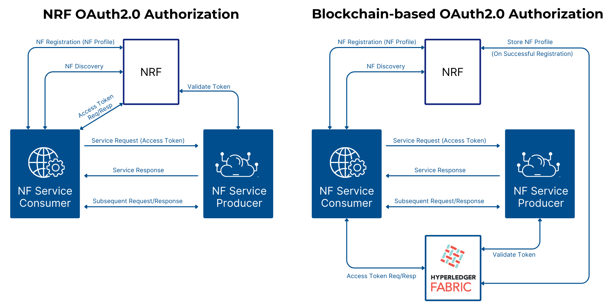

# Lab Name
FabricOAuth5G

# Short Description
Decentralized OAuth 2.0 authorization mechanism for NF authentication in 5G core networks using Hyperledger Fabric.

# Scope of Lab
This lab explores a decentralized trust model for NF authentication within 5G core networks, replacing traditional centralized authorization mechanisms with blockchain-based solutions. The core idea revolves around implementing OAuth 2.0 token issuance and validation using Hyperledger Fabric smart contracts. By integrating blockchain with open-source 5G core platforms (e.g., [Free5GC](https://free5gc.org/), [Magma](https://magmacore.org/), [Aether/SD-Core](https://opennetworking.org/sd-core/), [OpenAirInterface](https://openairinterface.org/oai-5g-core-network-project/), [Open5GS](https://open5gs.org/)), the lab will provide a secure, immutable, and distributed identity verification and authorization framework.

## Key objectives include:

- Designing and implementing smart contract-driven OAuth 2.0 token lifecycle management, covering NF authentication, token issuance, and validation.
- Seamlessly integrating blockchain infrastructure into 5G’s service-based architecture (SBA).
- Ensuring interoperability with Service-Based Interfaces (SBIs) across various Network Functions.
- Benchmarking system performance and evaluating security improvements in terms of resistance to identity spoofing, token misuse, and insider threats.

Future enhancements of this lab will include the integration of post-quantum cryptography (PQC), replacing classical cryptographic components—such as digital signatures, certificate authorities, symmetric encryption algorithms, and entropy sources — with quantum-resistant alternatives. This will provide forward security and ensure robustness against quantum attacks, including "store-now, decrypt-later" scenarios.

This lab directly contributes to the LF Decentralized Trust mission by demonstrating a practical application of decentralized authentication in next-generation telecom networks. It fosters open, secure, and verifiable trust frameworks aligned with the vision of resilient and tamper-proof infrastructure in decentralized ecosystems.

# Initial Committers
- https://github.com/chmodshubham 
- https://github.com/viprat 

# Sponsor
Vipin Rathi (@viprat) (vipkrathi2013@gmail.com) (Chair Hyperledger Telecom SIG)

# Pre-existing repository
None

