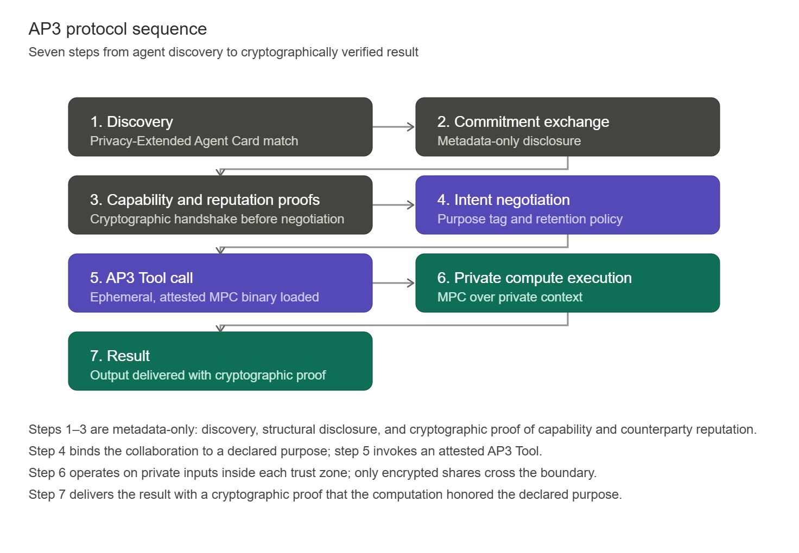

# Lab Name

Agent Privacy Preserving Protocol (AP3)

# Short Description

**Agent Privacy-Preserving Protocol (AP3)** is an open protocol that enables **distributed collective intelligence,** without sacrificing confidentiality and regulatory posture. Collective intelligence here means the capacity of autonomous agents, tools, humans, and institutions to reason jointly and accumulate shared context across organizational, jurisdictional, and vendor boundaries.

> 💡 **Documentation:** [https://ap3-protocol.org](https://ap3-protocol.org/)

Individually capable agents are already here; what the ecosystem lacks is a substrate on which they can _**think and act together**_ in a privacy preserving way. AP3 provides that layer to the existing stack. It is delivered as an extension to the open [Agent2Agent (A2A) protocol](https://a2a-protocol.org/latest/) in communication, integrates with [Google Agent Development Kit (ADK)](https://google.github.io/adk-docs/) at the build stage and will expand support to other agentic frameworks.

> AP3 is being designed to support most common inter-agent communication protocols including the Agent Communication Protocol (ACP, originated by IBM, hosted at the Linux Foundation under the Agentic AI Foundation), the Agent Gateway Protocol (AGP / SLIM, originated by Cisco, hosted at the Linux Foundation under AGNTCY), and emerging decentralized protocols such as the Agent Network Protocol (ANP, originated by the open-source ANP community).

Its cryptographic core - Secure Multi-Party Computation (SMPC) for privacy preserving compute, supplemented by Trusted Execution Environment (TEE) attestation for execution integrity, would turn cross-boundary collaboration into a verifiable, policy-bound computation rather than an implicit trust assumption. Collective agentic and human context thereby becomes a cryptographically guaranteed intelligence layer.

AP3 aims to address a core question in multi-agent systems (MAS):

> Once multi-agent workflows span more than one trust domain, the engineering problem is no longer interoperability but governed execution: how do agents jointly compute, reason and collectively innovate over _**sensitive inputs,**_ [_**context graphs,**_](https://foundationcapital.com/ideas/context-graphs-ais-trillion-dollar-opportunity) and [_**memory**_](https://blog.cloudflare.com/introducing-agent-memory/). In doing so each participant's data remains confidential, every contribution to the output is cryptographically attributable, and the computation is verifiable without a single trusted intermediary.

# Scope of Lab

## Technical approach

AP3 provides a privacy layer to the inter-agent communication stack at which agents jointly compute over their inputs without any party in the system seeing their data nor the computation function logic. The inputs to the joint private compute never leave the initiating agent, nor are transmitted to the network. The approach rests on two cryptographic building blocks composed into a single protocol surface:

- **Secure Multi-Party Computation (SMPC)** for joint evaluation of functions over inputs (context and memory fabric) held privately by each agent
- **Trusted Execution Environment (TEE) attestation**, as a complement to SMPC for execution integrity and hardware-rooted trust.

As the result of the computation, only the minimal inference or proof is disclosed to the calling agent. The inference returned to a calling agent is scoped to what the workflow requires: a boolean outcome such as a sanctions-screening result, a bounded risk score, a negotiated price, a verified set intersection, or a signed compliance attestation.

## Deliverables and roadmap

The Lab's work is organized into three phases. Phase 1 establishes the specification and reference implementation. Phase 2 broadens framework, protocol, and identity coverage. Phase 3 enables extensibility and outlines our vision for potential future research for the community.

## Phase 1 - Foundation (first two months)

- **AP3 protocol specification v1.0:** versioned specification published as an extension to Agent2Agent (A2A), with explicit extension points identified for ACP, AGP/SLIM, and ANP. Covers message formats, capability-disclosure semantics, mandate and attestation structures, and the SMPC and TEE trust-model definitions.
- **Reference SDK:** open-source SDK in Python and TypeScript. Build tools for Google ADK, CrewAI, LangGraph, and AutoGen via thin integration adapters.
- **Private compute API:** private Set Intersection (PSI) API to be exposed, as the most demanded privacy preserving computation function.
- **Documentation:** Published documentation and step-by-step tutorial on how to build your own agents from scratch and perform private compute. Deployed at [https://ap3-protocol.org](https://ap3-protocol.org/).
- **Code examples:** demo agents with architecture, reference implementation and mock data
- **Whitepaper:** complete white paper on cryptographic architecture, formal treatment of AP3's trust model, adversary assumptions, and privacy guarantees.

## Phase 2 — Breadth (months two to four)

- **Private compute API:** More APIs will be added in the next phases to provide custom logic building blocks for cross-organizational agent compute workflows: set operations (intersection, union, cardinality), threshold and qualification checks, private pricing and negotiation, compliance and sanctions screening, geospatial matching, credential verification, and multi-party aggregation.
- **Inter-agent protocol coverage:** support for ACP, AGP/SLIM, and ANP, to establish a more generic privacy layer across the agent ecosystem.
- **Capabilities and Reputation:** establishing cryptographic proofs for capability and joint reputation checks before negotiation
- **Payments interoperability for Private Commerce:** a payment-protocol-agnostic binding layer for agentic commerce standards including AP2, x402, and the MPP family, enabling privacy-preserving commerce negotiation, followed by payment, workflows that compose AP3 confidentiality with existing mandate semantics.
- **Use case corpus:** integration cookbooks and reference deployments for cross-organizational scenarios including financial risk profiling, cross-border compliance, federated credential verification, and supply-chain reconciliation.

## Phase 3 — Extensibility and next research (months four onward)

- **Domain-Specific Language (DSL) for user-defined private functions:** tooling for programming domain-specific logic as privacy-preserving functions within the AP3 framework, in addition to standard APIs.
- **Guardrails and Policies**: a track for expansion of Policy Engine, compute guardrails and deterministic verification anchors
- **Advanced protocol integration:** an open research track exploring integration of advanced MPC and threshold-cryptography constructions as they mature in the academic literature.
- **Formal verification:** a track for evaluation of AP3's core protocol flows against its stated security properties, in collaboration with academic contributors.

## Governance and maintenance

The AP3 Lab will follow LFDT Lab conventions: a public specification repository, a MAINTAINERS file with clearly identified initial committers, signed commits, semantic versioning of the protocol specification, and a lightweight RFC process for protocol amendments. Conformance-test results will be published openly. The Lab will produce quarterly status updates to the Lab Stewards per the LFDT Labs reporting cadence.

## Alignment with LFDT's mission

LFDT hosts the open development of technologies that distribute trust rather than concentrate it, covering ledger, identity, cryptographic, interoperability, and AI-assurance infrastructure. AP3 addresses a specific and consequential gap within that remit: as autonomous agents increasingly operate across organizational and jurisdictional boundaries, the trust properties of their collaboration cannot be sustained by contracts and channel security alone. AP3 aims to bring cryptographic guarantees -  privacy, attribution, verifiability, and post-quantum durability to the agent collaboration layer, composing with the identity and transport substrates LFDT and its adjacent Linux Foundation projects already steward. It strengthens the LFDT ecosystem.

# Initial Committers

- Aditya Gannavarapu - Maintainer [https://github.com/aditya-67](https://github.com/aditya-67)
- Andrei Bytes - Maintainer [https://github.com/fridgebuyer](https://github.com/fridgebuyer)
- Ambika Pande - [https://github.com/Paintedstork28](https://github.com/Paintedstork28)
- Jay Prakash - [https://github.com/jaysilence](https://github.com/jaysilence)
- Danish Javed - [https://github.com/dansilence](https://github.com/dansilence)
- Yogendra Sankhla - [https://github.com/yogendra-silencelabs](https://github.com/yogendra-silencelabs)

# Sponsor

- [LFDT maintainer handle - optional]

# Pre-existing repository

- [https://github.com/silence-laboratories/ap3](https://github.com/silence-laboratories/ap3)
