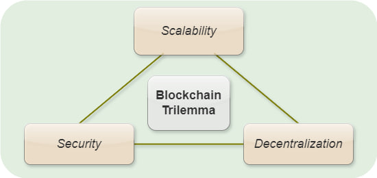

# Lab Name
[Waterfall Network](https://waterfall.network/)

# Short Description
Waterfall is a highly scalable smart contract network for the development of various decentralized applications (DApps).
The distributed protocol is based on DAG (Directed Acyclic Graph) technology, with a 2-level fast finality Proof-of-Stake (PoS) consensus protocol,
in which millions of validators can participate. It integrates with the Ethereum Virtual Machine (EVM)
that all Ethereum-based apps can be run on this network. Therefore, Waterfall can ensure a favorable environment
for the provision and consumption of a wide spectrum of enterprise-class services for business and social activities,
in a convenient format within the framework of a decentralized network.

# Scope of Lab
Despite its potential, Distributed Ledger Technology (DLT) is still an innovative technology, and some challenges need to be addressed.
One of the main obstacles is scalability, as the current generation of DLTs can only handle a limited number of transactions per second
without compromising on security and/or increased overall network centralization – the so-called trilemma of scalability, security,
and decentralization.

A well-known problem that concerns both users and developers is that an increasing throughput, transactions per second (TPS),
is usually in conflict with decentralization, and a balance should be found. Currently, the development of scalable networks
with custom features has gained significant traction and it is considered one of the crucial factors for the mass adoption of DLTs,
especially in enterprise-class applications.

The prime goal of the Waterfall Network is to provide a high-performance scalable ecosystem for the development of DApps
in various fields such as DeFi, DePIN, GameFi, IoT, Enterprise, etc.

# Initial Committers
- [Oleksandr Nashyvan](https://github.com/on-waterfall)
- [Volodymyr Mezin](https://github.com/VladimirMezin)
- [Dmytro Rogovyi](https://github.com/dimrogovoy)

This project is developed and maintained by [the Waterfall Network team](https://waterfall.network/community/our-team).

# Sponsor
_N/A_

# Pre-existing repository
- [Repository for coordinator](https://github.com/waterfall-network/coordinator)
- [Repository for verifier](https://github.com/waterfall-network/gwat)
- [Repository for one-click app](https://github.com/waterfall-network/one-click-setup-app)

The Ethereum library and binaries are licensed under the GNU Lesser General Public License v3.0 (LGPL-3.0)
and the GNU General Public License v3.0 (GPL-3.0) respectively. The code written for the Waterfall project is distributed
under the Apache License v2.0.

To address the licensing concerns, we will refactor the code to eliminate direct dependencies on GPL-3.0 libraries,
ensuring compatibilitywith the Apache License v2.0. Additionally, for LGPL-3.0 dependencies,
we will implement dynamic linking by creating Golang interfaces.

